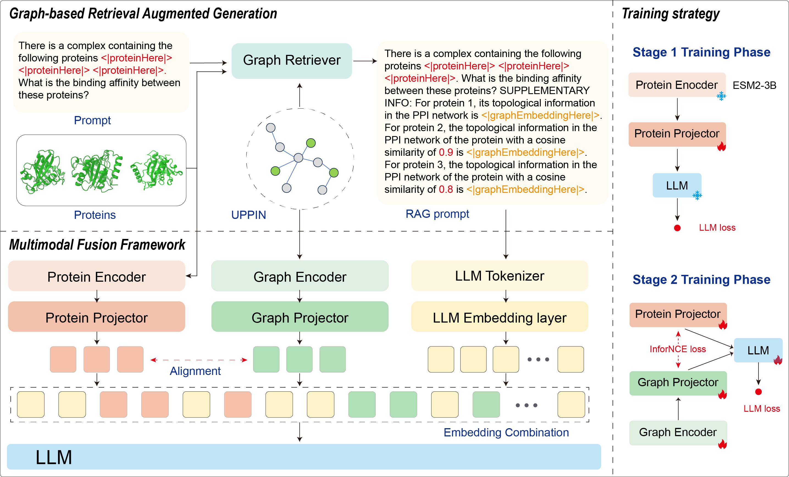

# LLAPA: Large Language and Protein Assistant for Protein-Protein Interactions Prediction



This work has been accepted by ACL 2025.

We provide the LLama3.2-3b version, which can be fine-tuned on an A100 40G GPU.

## Preliminary Steps

1. **Set Up Experimental Environment:**

   Create and activate a new Conda environment:

   ```bash
   conda create -n llapa python=3.8.19
   conda activate llapa
   ```

   Install the necessary packages:

   ```bash
   pip install torch==2.2.2 torchvision==0.17.2 torchaudio==2.2.2 --index-url https://download.pytorch.org/whl/cu118

   pip install pyg_lib torch_scatter torch_sparse torch_cluster torch_spline_conv -f https://data.pyg.org/whl/torch-2.2.2+cu118.html
   
   pip install torch-geometric
   pip install transformers==4.46.2
   pip install accelerate==1.0.1
   pip install peft==0.10.0
   pip install deepspeed==0.14.2
   pip install datasets==2.19.1
   pip install pandas==2.0.3
   pip install bitsandbytes==0.43.1
   ```

   We recommend using the environment specified above. However, the code should also work with the latest version of `transformers` by changing `evaluation_strategy` to `eval_strategy`.

2. **Download Required Backbone Models:**
   - Obtain the `meta-llama/Llama-3.2-3B-Instruct` model from [Hugging Face](https://huggingface.co/meta-llama/Llama-3.2-3B-Instruct) and convert the weights to Hugging Face format.
   - Download the `facebook/esm2_t36_3B_UR50D` model from [Hugging Face](https://huggingface.co/facebook/esm2_t36_3B_UR50D).

3. **Download Data:**
   - Access the data we provide from [LLAPA Dataset](https://drive.google.com/file/d/13D-JAnBF4Pm7COre48QP1-NfSWEmGIv2/view?usp=drive_link).

4. **Pre-trained Protein Encoder:**
   - Retrieve the pre-trained protein encoder weights from [facebook/esm2_t36_3B_UR50D](https://huggingface.co/facebook/esm2_t36_3B_UR50D).

5. **Fine-tuned Weights:**
   - Obtain the fine-tuned weights on SHS27k from [Example weight](https://drive.google.com/file/d/1fXn32sTF-JbnHDu3vfCtPZ2zem8JGQ4G/view?usp=drive_link).

6. **Configuration Modifications:**
   - Update `ROOT_DIR`, `DATA_DIR`, and `LLM_CONFIG_PATH` in `config/configs.py`.
   - Modify `_name_or_path`, `ROOT_DIR`, and `DATA_DIR` in `config/llama3-3b-backbone/configs.json`.

## Pre-training

Since pre-trained weights are provided, pre-training is not necessary. However, if you wish to perform pre-training, execute the following command:

```shell
sh zero2_stage1.sh
```

## Fine-tuning

To fine-tune the model, run:

```shell
sh zero2_stage2.sh
```

## Inference

For inference, execute:

```shell
sh eval.sh
```